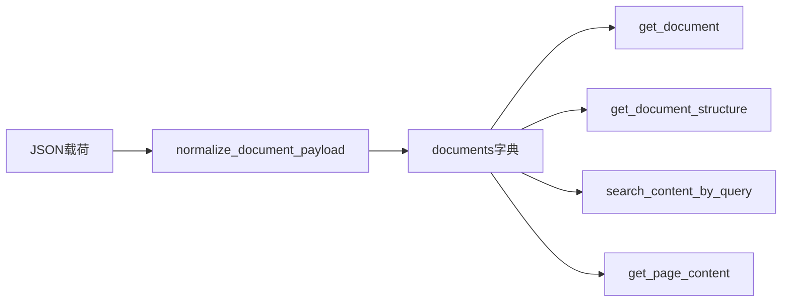
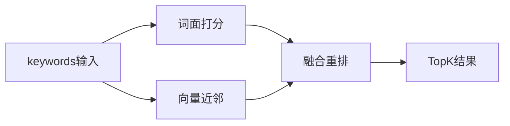

# 从树到正文的检索设计

本文档描述 DemoIndex 侧「树索引 + 正文按需获取」的检索设计。**默认主路径为向量无关的词面检索**：**终端用户的输入为关键词**（可为单个词，或多个词以空格、逗号、顿号等分隔的短文本，例如 `下载量` 或 `拉美, 安装量, 游戏`），系统依据规范化后的 **search_terms** 在 Markdown 节点的 `title` / `summary` / `text` 上做词面匹配并返回最相关片段。**§5** 补充可选的**语义检索**（基于 embedding 与向量相似度），用于同义表达、词面不一致时的召回增强，与 §4 可独立或混合使用。**按逻辑页码 `page_index` 拉取正文**为**辅助能力**（已知页范围、调试或与 PageIndex 式 Agent 工具兼容）。

实现可参考开源 PageIndex 的 [`retrieve.py`](file:///D:/code/PageIndex/PageIndex-main/pageindex/retrieve.py) 中按页取数的接口形态；DemoIndex 在 Markdown 产物上约定 **§4 关键词词面检索**（[`retrieve.py`](file:///D:/code/demo-index/demo-index/DemoIndex/retrieve.py) 中参数名为 `keywords`）。

## 1. 目标与总体流程

- **目标**：在不全文灌入上下文的前提下，利用**树形索引**（标题、节点 ID、摘要、节点内正文等）支撑检索；**关键词场景**下将用户输入解析为 **search_terms**，与节点文本对齐后返回最相关片段；必要时再用页码类接口做精读。
- **推荐流程**（关键词主路径）：
  1. 将已生成的 JSON 载荷注册为内存中的 `documents[doc_id]`。
  2. 用户提交关键词 → 调用 **`search_content_by_query`**（或等价接口；入参为关键词字符串），在节点的 `title` / `summary` / `text` 上匹配并排序，返回 Top-K 条带 **`node_id`、`title`、`content`** 的结果。
  3. 可选：先 **`get_document`** 了解规模；需要浏览目录而不拉正文时调用 **`get_document_structure`**（无 `text`）。
- **辅助流程**（已知逻辑页范围时）：
  - 构造 `pages` 字符串，调用 **`get_page_content`** 按 **`page_index` 闭区间** 取节点 `text`（见 **§3.6–§3.10**）。

## 2. 文档树数据结构（参考样例）

实现与测试可对照以下文件中的树形字段（均为 PageIndex 风格、顶层含 `result` 数组的**森林**）：

- [`docs/results_with_vlm/game2025report_v7/combined_document_output.json`](file:///D:/code/demo-index/demo-index/DemoIndex/docs/results_with_vlm/game2025report_v7/combined_document_output.json)
- [`docs/results_with_vlm/game2025report_v7/MinerU_markdown_game2025report_output.json`](file:///D:/code/demo-index/demo-index/DemoIndex/docs/results_with_vlm/game2025report_v7/MinerU_markdown_game2025report_output.json)

### 2.1 顶层字段（与样例一致）

| 字段 | 含义 |
|------|------|
| `doc_id` | 文档唯一标识 |
| `status` | 处理状态 |
| `retrieval_ready` | 是否声明可检索（实现可不强制依赖） |
| `line_count` | 合并 Markdown 全文行数 |
| `summary` | 文档级摘要 |
| `result` | **森林**：多棵根节点，每棵为递归树 |

### 2.2 节点字段（与样例一致）

| 字段 | 含义 |
|------|------|
| `title` | 节点标题；**关键词检索的重要匹配域** |
| `node_id` | 节点 ID（如 `0007`） |
| `page_index` | 与 MinerU `<!-- page:N -->` 对齐的**逻辑页码**；**主要用于出处标注与按页精读**，不是关键词检索的主排序键 |
| `text` | 该节点对应正文片段；**关键词检索的核心匹配域** |
| `summary` | 节点摘要；**关键词检索的匹配域** |
| `nodes` | 子节点列表（可选，递归同结构） |

### 2.3 与上游 `retrieve.py` 的差异（适配要点）

PageIndex 原版 Markdown 路径约定：

- 内存中 `doc_info['structure']` 为树；子树检索依赖节点上的 **`line_num`**，`get_page_content` 的 `pages` 表示**行号区间**内命中节点的 `text`。

DemoIndex 当前产物：

- 树在 **`result`** 中，节点使用 **`page_index`**，无 `line_num`。
- 实现时需 **`normalize_document_payload`**：将 `result` 映射为内部 `structure`。
- **用户关键词场景**：在 `structure` 上对每个节点用 **§4** 的词面匹配打分，**不依赖用户预先提供页码**。
- **辅助场景**：仍可实现 **`get_page_content`**，按 **`page_index` 区间** 过滤节点（与上游按行号区间对称）。

## 3. 函数清单：树处理、规范化与按页取数（入参、返参、作用）

下列函数构成与 PageIndex 对齐的**基础能力**及 **按 `page_index` 的辅助取数**；**关键词主路径函数见 §4**。

### 3.1 `remove_fields(structure, fields) -> list | dict`

| 项目 | 说明 |
|------|------|
| **作用** | 递归复制树并删除指定字段（如 `text`），避免把大段正文交给仅导航阶段。 |
| **入参** | `structure`：树或森林（list/dict）；`fields`：要移除的字段名列表。 |
| **返参** | 去掉字段后的同形结构。 |
| **备注** | 可直接复用 PageIndex [`utils.remove_fields`](file:///D:/code/PageIndex/PageIndex-main/pageindex/utils.py)，或在本仓库实现等价函数。 |

### 3.2 `normalize_document_payload(raw: dict, doc_name: str | None = None) -> dict`

| 项目 | 说明 |
|------|------|
| **作用** | 将 DemoIndex 导出的 JSON **规范化**为检索层使用的 `doc_info`：例如 `structure = raw['result']`，写入 `line_count`、`summary`、`type`（如 `'markdown'`）、可选 `doc_name` / `doc_description`。 |
| **入参** | `raw`：磁盘或接口读入的完整 JSON；`doc_name`：可选展示名。 |
| **返参** | 单份 `doc_info` 字典，可供 `documents[doc_id] = doc_info`。 |

### 3.3 `_parse_pages(pages: str) -> list[int]`

| 项目 | 说明 |
|------|------|
| **作用** | 解析 `pages` 字符串为去重升序的整数列表。支持 `"12"`、`"3,8"`、`"5-7"`。 |
| **入参** | `pages`：逗号分隔与连字符区间的组合字符串。 |
| **返参** | `list[int]`；非法范围（起点大于终点）应抛错或由上层捕获并返回错误 JSON。 |

### 3.4 `_count_pages(doc_info: dict) -> int`

| 项目 | 说明 |
|------|------|
| **作用** | 返回 PDF 的总页数；从 `page_count`、缓存 `pages` 长度或磁盘 PDF 路径解析（与上游一致）。 |
| **入参** | `doc_info`：规范化后的文档记录。 |
| **返参** | 总页数（int）。 |
| **备注** | DemoIndex 若以 Markdown 为主、仅逻辑 `page_index`，可仅在 `type == 'pdf'` 时调用；否则返回 0 或不实现 PDF 分支。 |

### 3.5 `_get_pdf_page_content(doc_info: dict, page_nums: list[int]) -> list[dict]`

| 项目 | 说明 |
|------|------|
| **作用** | 按 **1-based物理页码** 取 PDF 文本；优先使用 `doc_info['pages']` 缓存，否则 `PyPDF2` 读 `doc_info['path']`。 |
| **入参** | `doc_info`：含 `path` 或缓存 `pages`；`page_nums`：目标页码列表。 |
| **返参** | `[{'page': int, 'content': str}, ...]`，顺序与请求一致或按页码排序（与上游行为一致即可）。**无树节点语义**，不要求 `node_id` / `title`。 |

### 3.6 【辅助】`_get_md_page_content(doc_info: dict, page_nums: list[int]) -> list[dict]`

| 项目 | 说明 |
|------|------|
| **作用** | **按逻辑页定位**（非关键词主路径）：在 `structure` 上递归查找 **`page_index` 落在 `[min(page_nums), max(page_nums)]` 闭区间内**的节点，收集其 `text`。 |
| **入参** | `doc_info`：含 `structure`（由 `result` 规范化而来）；`page_nums`：解析后的整数列表。 |
| **返参** | 命中节点列表，**每条必须包含** `page`、`content`、`node_id`、`title`（见 **§3.10**）。其中 `page` 取该节点的 **`page_index`**。 |
| **备注** | 同一 `page_index` 多节点命中时，列表中保留多条，靠 `node_id` 区分。若未来节点补充 `line_num`，可增加与 `page_index` 二选一的策略。 |

### 3.7 `get_document(documents: dict, doc_id: str) -> str`

| 项目 | 说明 |
|------|------|
| **作用** | 返回文档元数据的 **JSON 字符串**（便于作为工具返回给 Agent）。 |
| **入参** | `documents`：`doc_id -> doc_info`；`doc_id`：目标文档 ID。 |
| **返参** | JSON 字符串：含 `doc_id`、`doc_name`、`doc_description`、`type`、`status`；PDF 含 `page_count`，Markdown 含 `line_count`。找不到文档时返回 `{"error": ...}`。 |

### 3.8 `get_document_structure(documents: dict, doc_id: str) -> str`

| 项目 | 说明 |
|------|------|
| **作用** | 返回整棵（或多根）树的结构 JSON，并 **移除 `text`**，保留 `title`、`node_id`、`page_index`、`summary`、`nodes` 等导航字段。 |
| **入参** | `documents`；`doc_id`。 |
| **返参** | JSON 字符串（`ensure_ascii=False` 以保留中文）；错误同上。 |

### 3.9 【辅助】`get_page_content(documents: dict, doc_id: str, pages: str) -> str`

| 项目 | 说明 |
|------|------|
| **作用** | 在**已知页码表达式**时，按 `pages` 解析结果调用 `_get_pdf_page_content` 或 `_get_md_page_content`，返回正文列表的 JSON 字符串。**用户按关键词找内容时应优先使用 §4 的 `search_content_by_query`。** |
| **入参** | `documents`；`doc_id`；`pages`：如 `"5-7"`、`"3,8"`、`"12"`。 |
| **返参** | JSON 字符串：成功时为对象数组，元素字段见 **§3.10**；`type == 'pdf'` 时仅含 `page` 与 `content`；Markdown 含四条字段。失败时为 `{"error": ...}`。 |

### 3.10 【辅助】`get_page_content` 成功时每条结果字段（Markdown / PDF）

| 字段 | Markdown（`combined_document_output` 等） | PDF |
|------|----------------------------------------|-----|
| `page` | 必填。对应节点 **`page_index`**（逻辑页码）。 | 必填。物理页码（1-based）。 |
| `content` | 必填。节点 **`text`**。 | 必填。该页抽取文本。 |
| `node_id` | **必填**。与树节点一致，供引用、去重、回指结构。 | 不要求（可不输出或省略该键）。 |
| `title` | **必填**。与树节点 **`title`** 一致，供展示与引用。 | 不要求（可不输出或省略该键）。 |

编排层与下游展示应优先使用 **`doc_id` + `node_id` + `title` + `page`** 组成可追溯引用；`content` 为实际片段正文。

---

## 4. 关键词检索（用户主路径，向量无关）

### 4.1 设计目标

- **用户输入形态**：用户向系统提供**关键词**，而不是必须以完整自然语言问句形式提问。典型形式包括：单个词（如 `下载量`）、多个词以分隔符连接的短串（如 `拉美,安装量` 或 `TOP10 游戏`）。系统**不得**依赖用户或上层先提供 `page_index` 或页码区间。
- **search_terms**：将上述输入经 **`_extract_search_terms`**（或等价逻辑）规范为词条列表——以**切分、去空白、去无关标点、可选停用词过滤**为主；**不要求**按「问句」做句法分析。若用户只给一个长短语且无分隔符，实现可将其整体作为一个检索单元，或按语言做保守切分（见 **§4.3.1**）。
- 在整棵 `structure` 上对每个节点的可检索文本做**词面级匹配**（子串命中、字段加权等），返回排序后的最相关节点正文。
- 仍为**向量无关**：不使用 embedding 与向量库；实现可做 TF-style、BM25 或简单命中计数，后续可迭代。

### 4.2 匹配域与 `page_index` 的角色

| 节点字段 | 在关键词检索中的角色 |
|----------|-------------------|
| `title` | 高权重匹配域（章节标题往往含主题词） |
| `summary` | 中高权重（概括性命中） |
| `text` | 主匹配域（正文中的关键字、实体、数据） |
| `page_index` | **不参与「是否命中」的必需条件**；结果中随节点输出，用于引用与按需跳转 |

### 4.3 推荐函数

#### 4.3.1 `_extract_search_terms(keywords: str, *, locale: str = "zh") -> list[str]`

| 项目 | 说明 |
|------|------|
| **作用** | 将**用户输入的关键词字符串**规范为用于匹配的 **search_terms**（去首尾空白、统一分隔符为切分边界、英文可小写；中文可按连续汉字块、英文按 `[a-zA-Z]{2,}` 等规则拆词；**关键词场景下停用词表宜保守**，避免误删用户明确提供的检索词）。 |
| **入参** | `keywords`：用户提交的一个字符串（实现层若参数名为 `query`，文档语义仍视为关键词输入）；`locale`：语言提示。 |
| **返参** | 非空词条列表；若规范化后为空，实现可回退为字符 n-gram 等（须在实现注释中说明）。 |

#### 4.3.2 `_score_node_for_terms(node: dict, terms: list[str]) -> tuple[float, list[str]]`

| 项目 | 说明 |
|------|------|
| **作用** | 对单个节点计算**相关性得分**，并返回在节点文本中实际命中的词条子集（用于 `matched_terms`）。 |
| **入参** | `node`：含 `title`、`summary`、`text` 等；`terms`：`_extract_search_terms` 的输出。 |
| **返参** | `(score, matched_terms)`；`score` 为非负浮点；加权规则由实现定义（例如 `title` 命中权重高于 `text`）。 |

#### 4.3.3 `search_content_by_query(documents: dict, doc_id: str, keywords: str, *, top_k: int = 8, min_score: float = 0.0) -> str`

| 项目 | 说明 |
|------|------|
| **作用** | **关键词检索主接口**（**词面**，向量无关）：遍历 `structure` 全部节点，对 `type == 'markdown'` 文档按 **search_terms** 打分，保留 `score >= min_score` 的节点，按分降序取前 `top_k`，序列化为 JSON 字符串。 |
| **入参** | `documents`；`doc_id`；`keywords`：**关键词输入字符串**；`top_k`；`min_score`。 |
| **返参** | JSON 数组字符串；**每条**建议包含：`node_id`、`title`、`content`（节点 `text`）、`page`（等于 `page_index`，无则省略或 `null`）、`score`、`matched_terms`。找不到文档、无有效词条等情形返回 `{"error": ...}`。 |
| **备注** | PDF 类型文档可不支持本接口；须在实现中明确。**语义相似度检索见 §5**，非本函数职责。 |

### 4.4 结果字段与引用约定

关键词检索成功时，每条结果应至少包含：

| 字段 | 说明 |
|------|------|
| `node_id` | 与树一致，**必填**（Markdown）。 |
| `title` | **必填**。 |
| `content` | 节点 **`text` 全文或按需截断**（若截断须在字段或元数据中说明，如 `truncated: true`）。 |
| `page` | 逻辑页 **`page_index`**，便于与印刷版对照。 |
| `score` | 相关性得分，便于调试与多轮重排。 |
| `matched_terms` | 可选；本次命中的关键词，便于说明「因哪些词召回」。 |

引用格式仍建议：**`doc_id` + `node_id` + `title` + `page`**。

### 4.5 与 `get_page_content` 的分工

| 场景 | 推荐接口 |
|------|----------|
| 用户按**关键词**查找正文 | **`search_content_by_query`** |
| 已知「第 6–8 逻辑页」精读、调试、兼容 PageIndex 工具 | **`get_page_content`** |
| 仅需目录与摘要、不拉正文 | **`get_document_structure`** |
| 需要**同义改写、近义表达**也能命中（词面不一致） | **§5 语义检索**（扩展实现） |

---

## 5. 语义检索（扩展路径，可选实现）

本节描述在**不改变现有词面检索主路径**的前提下，如何增加**基于向量相似度的语义检索**。当前仓库默认实现（[`retrieve.py`](file:///D:/code/demo-index/demo-index/DemoIndex/retrieve.py)）**仅包含 §4 词面检索**；语义能力可作为后续迭代单独模块或接口。

### 5.1 与词面检索的差异

| 维度 | §4 关键词 / 词面检索 | §5 语义检索 |
|------|----------------------|------------|
| 匹配依据 | 字符串子串、词项是否在 `title` / `summary` / `text` 中出现 | 查询与节点文本的 **embedding** 在向量空间中的相似度（如余弦相似度） |
| 同义词 / 改写 | 一般**不能**命中字面不同的表达 | **可以**召回语义相近但用词不同的段落 |
| 可解释性 | `matched_terms` 直观 | 宜增加 `similarity` 或 `semantic_score`；可附「近邻片段」说明 |
| 依赖 | 无外部模型、无向量库 | **嵌入模型**（API 或本地）+ **向量存储与检索**（内存索引、FAISS、Milvus、Qdrant 等） |
| 成本与延迟 | 低 | 建索引与每次查询的算力 / 调用费用更高 |

### 5.2 适用场景

- 用户关键词与正文表述不一致（例：用户搜「营收」，正文写「收入」）。
- 短查询、概念性检索，词面 Top-K 召回不足或排序不理想。
- 与 §4 **混合**：先语义扩召回，再用词面重排；或两路结果 **RRF / 加权融合**。

### 5.3 索引粒度与内容构造

- **推荐单元**：与现有树一致，以 **`structure` 中每个节点** 为一条检索文档（将 `title`、`summary`、`text` 按固定模板拼接为一段 `passage`，再编码为向量）。
- **可选**：节点过长时在 `text` 内按字符数或段落**滑窗切块**，每块独立向量并回指同一 `node_id`（结果去重或聚合）。
- **元数据**：每条向量至少绑定 `doc_id`、`node_id`、`page_index`（若有），便于返回格式与 §4.4 对齐。

### 5.4 查询侧

- 对用户输入的**关键词字符串**（与 §4 相同输入形态）整体或经轻量拼接后调用 **同一嵌入模型**，得到 **query_vector**。
- 在向量库中做 **Top-K 近邻检索**（余弦相似度、内积等，与索引阶段度量一致）。
- 阈值：可设 `min_similarity`，低于则丢弃，避免噪声召回。

### 5.5 推荐接口形态（设计约定，非强制命名）

| 项目 | 说明 |
|------|------|
| **候选名** | `search_content_semantic(documents, doc_id, keywords, *, top_k=8, min_similarity=0.0) -> str` |
| **入参** | 与 §4 对齐：`keywords` 为用户关键词串；可增加 `model`、`language` 等由实现定义。 |
| **返参** | JSON 数组；字段与 §4.4 对齐，并建议包含 **`semantic_score` 或 `similarity`**（浮点，与具体度量一致）；可不包含 `matched_terms`，或仅在有辅助词面过滤时填充。 |
| **建库** | `index_document_semantic(doc_info)` 在 `normalize_document_payload` 之后异步构建；文档更新时需 **增量更新或全量重建** 索引。 |

也可在单一入口上通过参数 **`mode="lexical" | "semantic" | "hybrid"`** 切换；`hybrid` 的融合权重与归一化方式须在实现与注释中写明。

### 5.6 混合检索（可选）

- **并行**：对同一 `keywords` 分别执行 §4 与 §5，得到两列候选后 **RRF** 或对数归一化后加权求和。
- **级联**：用语义 Top-M 缩小候选集，再对候选集用词面打分精排（或反之）。

### 5.7 工程与运维注意

- **嵌入模型版本变更**需 **重建索引**，否则与查询向量空间不一致。
- **中英混合** 文档需选用支持中文或 multilingual 的模型；维度固定后方可落库。
- **隐私与合规**：若走云端 embedding API，需满足数据出境与留存策略。

### 5.8 与本文档其它章节的关系

- §1～§4、按页取数（§3）仍为**基线设计**；§5 **不替代** §4，而是**增强选项**。
- 实现语义路径后，**§6** 注释规范同样适用于新增函数；**§7** 编排层可约定「默认词面、可选语义或混合」。

## 6. 开发阶段注释规范

实现上述函数时，**须为每个函数补齐注释**：说明函数功能，以及**每个入参**与**返回值**的含义。格式与 [`build_md_pageindex.py`](file:///D:/code/demo-index/demo-index/DemoIndex/build_md_pageindex.py) 保持一致，例如：

- 模块级：文件顶部用三引号字符串简述模块职责（可参考该文件的模块 docstring 风格）。
- 函数级：在 `def` 下方使用三引号 docstring，包含：
  - 一句话功能描述；
  - **`入参:`** 小节：逐项列出参数名与语义；
  - **`返回:`** 小节：说明返回值结构与错误情况（若适用）。

私有函数（以下划线开头）同样需要完整 docstring，便于后续维护与对接 Agent 工具描述。**§4** 须写清：入参为**关键词输入**时的切分规则、字段加权公式及 `locale` 行为。若实现 **§5**，须写清嵌入模型、相似度度量、索引更新策略及与词面结果融合方式。

## 7. 与编排层 / LLM 的约定建议

- **用户关键词入口**：默认调用 **`search_content_by_query`**，将 Top-K 结果片段作为下游上下文；**不要**要求用户先猜页码。
- **导航阶段**：需要「只看目录」时调用 **`get_document_structure`**；需要规模时调用 **`get_document`**。
- **精读阶段**：仅在已确定逻辑页范围时（例如用户明确「看第 10 页附近」或从结果中的 `page` 收窄范围）使用 **`get_page_content`**，避免一次请求覆盖无关大区间。
- **森林结构**：`result` 为多根时，`structure` 为列表；`get_document_structure` 与 `search_content_by_query` 均需遍历全部根与子树。
- **语义检索（若已落地 §5）**：由编排层决定默认 `lexical` / `semantic` / `hybrid`；混合时需向用户或日志披露主要排序依据（词面分、相似度分），便于排错。

## 8. 参考与依赖

- PageIndex 检索实现：[`D:\code\PageIndex\PageIndex-main\pageindex\retrieve.py`](file:///D:/code/PageIndex/PageIndex-main/pageindex/retrieve.py)
- 本仓库注释范例：[`build_md_pageindex.py`](file:///D:/code/demo-index/demo-index/DemoIndex/build_md_pageindex.py)
- 树数据样例：[`combined_document_output.json`](file:///D:/code/demo-index/demo-index/DemoIndex/docs/results_with_vlm/game2025report_v7/combined_document_output.json)、[`MinerU_markdown_game2025report_output.json`](file:///D:/code/demo-index/demo-index/DemoIndex/docs/results_with_vlm/game2025report_v7/MinerU_markdown_game2025report_output.json)

---

文档版本：**§4 关键词词面检索**为默认主路径（`search_content_by_query` 参数 `keywords`）；**§5 语义检索**为可选扩展；按 `page_index` 的 `get_page_content` 为 **§3 辅助**。若产物增加 `line_num` 或统一为单根 `structure` 字段，应同步更新 §2.3 与 §3.6。
